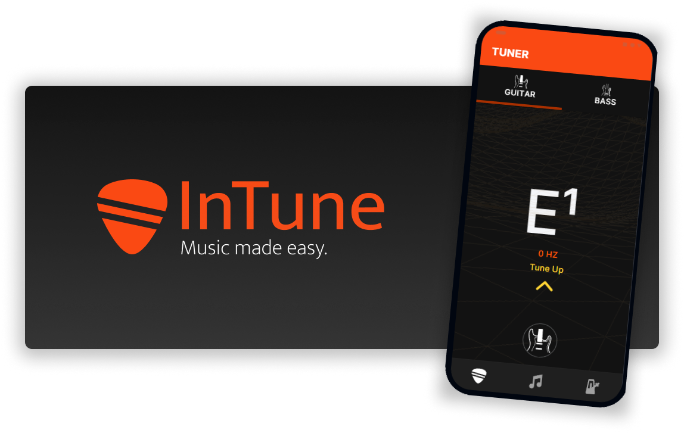
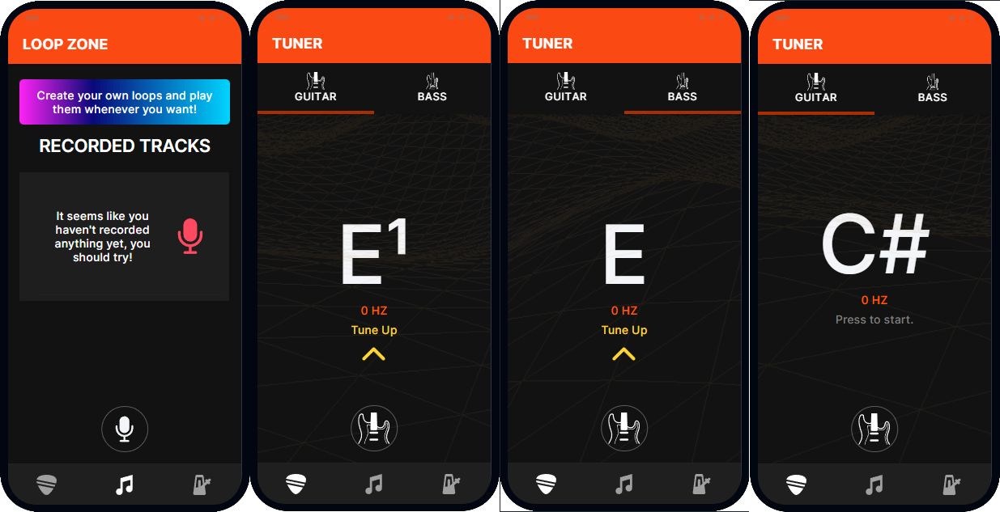
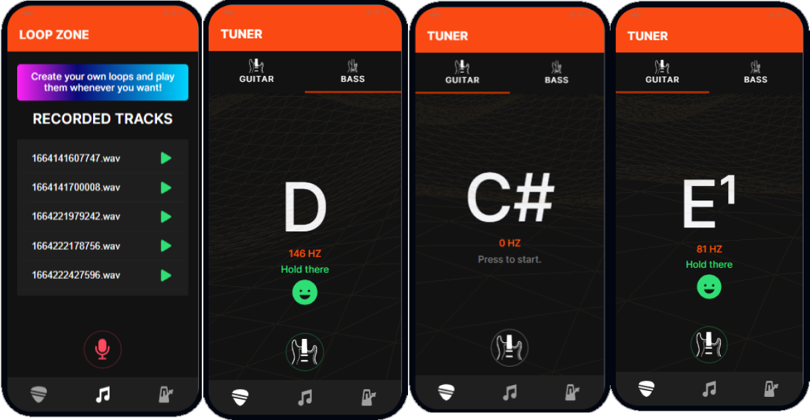

<br>

<h1 align="center">InTune</h1>
<p align="center">Music made easy.</p>
<p align="center">

<p align="center">
  
  
  
</p>

## Startup:
```pwsh
  npm i
  ionic serve
```
# Preview




## Wiki:

Licensing information, about:
[InTune](https://github.com/LucasVieiraS/InTune-Tuner/wiki)

## Extra:

Final Project created for [**CS50x**](https://cs50.harvard.edu/x/) 2022.
