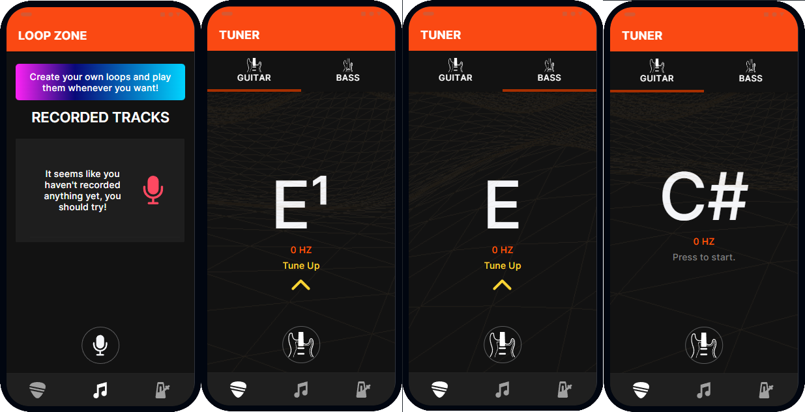

<br>

<h1 align="center">InTune</h1>
<p align="center">Music made easy.</p>
<p align="center">

## Startup:
```pwsh
  npm i
  ionic serve
```
# Preview



## Extra:

Final Project created for [**CS50x**](https://cs50.harvard.edu/x/) 2022.
